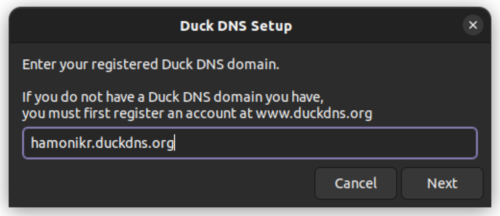
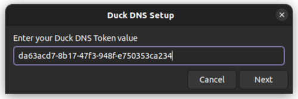

## Duck DNS GUI

What is Duck DNS?
 - https://www.duckdns.org/about.jsp

`Duck DNS is a free service which will point a DNS (sub domains of duckdns.org) to an IP of your choice`

Duck DNS 는 도메인 필요한 사용자가 무료로 도메인을 사용할 수 있는 동적 DNS 서비스입니다.

## Install

1. Download file from [release page](https://github.com/hamonikr/duckdns/releases)
2. Open Terminal and Type as below

```sh
sudo dpkg -i duckdns_*.deb
```
## Usage
#### 1. Create your account from Duck DNS Service
 - https://www.duckdns.org/

#### 2. Setup your domain
 
#### 3. Setup your token
 

## how to translate
Add your language to `usr/local/bin/duckdns` file 'TRANSLATION' section as below part
```
title="Duck DNS Setup"
text1="Enter your registered Duck DNS domain.\n\nIf you do not have a Duck DNS domain you have,\nyou must first register an account at www.duckdns.org"
button1="Next"
text2="Invalid domain name.\n\nThe program will now quit."
text3="Enter your Duck DNS Token value"
text4="Please click Next to continue or Cancel to quit.\nIt will take a few seconds for the setup to complete."
button2="Cancel"
text5="Setup canceled"
button3="Done"
text6="Command not found : curl\n\nTry again, after install curl."
text7="[Error] Duck DNS did not update correctly.\n\nPlease check your settings or run the setup again."
text8="Duck DNS is working fine."
text9="Duck DNS setup complete\n\nDuck DNS Status :"
```

## Author

👤 [Kevin Kim](https://github.com/chaeya)

## 🤝 Contributing

Feel free to check [issues page](https://github.com/hamonikr/duckdns/issues).

## Show your support

Give a ⭐️ if this project helped you!
